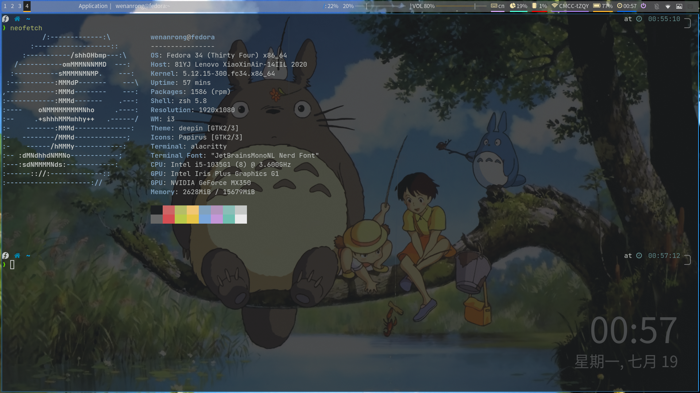
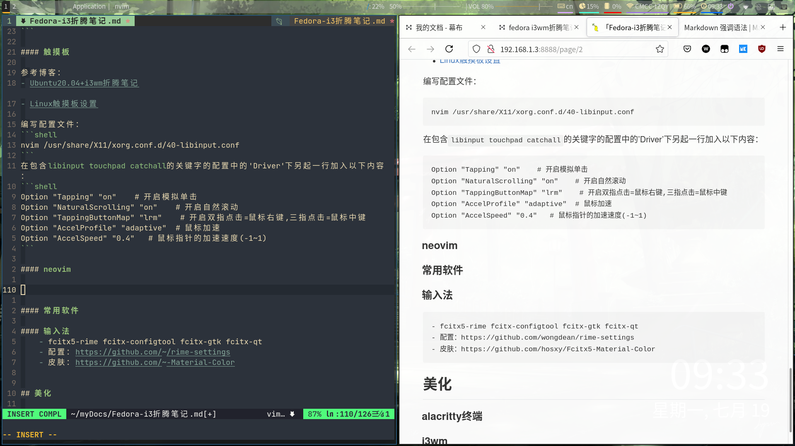
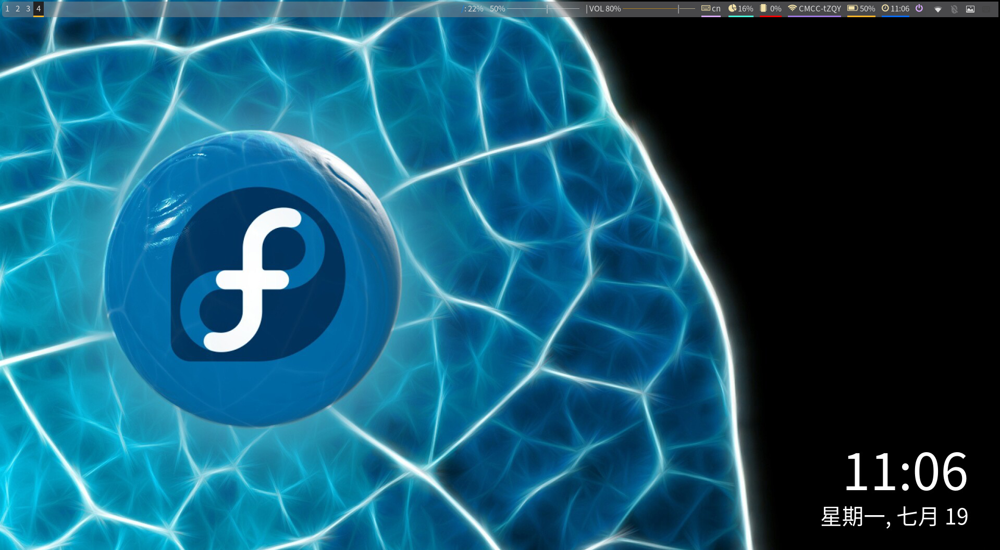

# i3wm-config

### 介绍

我的电脑
| 项目    | 配置                          |
| ------- | -------                       |
| 品牌    | Lenovo XiaoXinAir-14IIL 2020  |
| 系统    | windows + fedora linux 双系统 |

这里的wallpaper是我的墙纸，可以不用复制

图片:




### 安装一些必备软件：

| 名称                | 作用                          |
| -------             | --------                      |
| blueman             | 蓝牙管理                      |
| rofi                | 查找软件                      |
| alacritty           | 终端模拟器                    |
| polybar             | 一个bar                       |
| feh                 | 墙纸软件                      |
| variety             | 以feh为基础的墙纸自动刷新软件 |
| picom               | 渲染器，可以让终端半透明      |
| i3-gaps             | 可以实现多个窗口间的小间距    |
| fcitx5              | 输入法                        |
| fcitx5-rime         | 输入法方案                    |
| fcitx5-configtool   | 输入法配置界面                |
| deepin-screenshot   | 截图工具                      |
| v2ray-core          | v2ray后台服务                 |
| v2rayA              | v2ray前台                     |
| light               | 亮度调节                      |
| unifont-fonts       | polybar need the font         |

### v2ray

介绍：墙

- v2ray-core:

下载这个文件：https://raw.githubusercontent.com/v2fly/fhs-install-v2ray/master/install-release.sh

无法下载的话可以去这里下载[github加速下载](https://d.serctl.com/)

然后依次执行以下命令：
```shell
chmod +x 刚刚的文件
sudo ./刚刚的文件
sudo systemctl enable v2ray&&sudo systemctl start v2ray
```
完成

- v2rayA

github项目地址：[v2rayA](https://github.com/v2rayA/v2rayA)

安装：rpm -i 包名

完成


### 字体:

github项目：[nerd-fonts](https://github.com/ryanoasis/nerd-fonts)

克隆项目下来后，进入项目文件夹，执行
```shell
./install.sh JetBrainsMono 
```
即可

### polybar

github项目：[polybar](https://github.com/polybar/polybar)

polybar中的一些配置需要读取系统信息，可能你的电脑与我的不同就无法使用了，具体请自己查看wiki

配置好我的配置文件后可以输入
```shell
~/.config/polybar/launch.sh
```
查看polybar的报错信息
